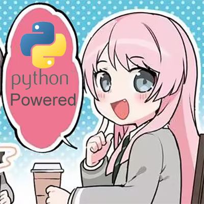

<p align="center">
    
</p>

<div align="center">

# Anon_Chihaya_bot_v2

**你好，我是爱音！**

这是一个基于 NoneBot 框架编写的 python 同步-多线程机器人框架

</div>

## 你好！

**Anon_Chihaya_bot 框架**的整体灵感来源于 **[NoneBot](https://github.com/nonebot/nonebot2/tree/master) 框架**，但是在此基础之上略有不同。**Anon_Chohaya_bot** 大幅度地简化了框架内部的结构，修改了部分的面向对象设计，并将所有的异步操作语句以同步-多线程的形式进行了替换，因此 **Anon_Chihaya_bot 框架**在运行安全上相比 NoneBot 框架更加**没有保障**，因此**并不推荐使用**。

### こんにちは！愛音です！

**Anon_Chihaya_bot** 的命名灵感来源自企划 《BanG Dream!》 中的乐队 [MyGO!!!!!](https://zh.moegirl.org.cn/MyGO!!!!!) 的角色 [千早 愛音](https://zh.moegirl.org.cn/%E5%8D%83%E6%97%A9%E7%88%B1%E9%9F%B3) 。

## 使用

如果您执意使用本框架（或者只是想看个笑话），那么以下步骤可以初步地建立起一个最简单的机器人应用。

### 配置

**Anon_Chihaya_bot 框架**支持多实例配置（但是不推荐你使用），框架的配置文件位于框架同目录的 `config.yml` 文件中。打开该文件，进行配置设定。

- **主人账号设置**

    在配置文件中，存在如下字段：
    ```yaml
    host_id: "123456"
    ```
    将该字段的值替换为你的 `账号 ID` 可以将所有的机器人实例的绝对管理员权限都交付与你。该项设置与机器人的 `/admin` 管理员操作功能和 `/ban` 屏蔽功能相关，因此只要能够获取到准确的 `账号 ID` ，都建议你进行配置。

- **协议实例配置**

    **Anon_Chihaya_bot 框架**支持多实例配置，但是并不支持同时使用多协议。因此，在配置文件中，存在如下内容：
    ```yaml
    # 以下内容为针对 Satori 协议进行的配置
    # Anon Chihaya Bot 默认选用该协议启动
    Satori:
    # 支持单协议的多实例运行，单个实例单独进行设定，前后无顺序关系
    # WARNING: 请不要对多个实例进行相同的配置，尽管这并不会影响实际的运行
    - version: 1 # Satori 协议版本，目前只有 1
      # WebSocket 服务连接所需配置
      WebSocket:
        ip: "127.0.0.1" # 进行连接的 WebSocket 所在服务器 IP，本地启动则填入 127.0.0.1
        port: 5140 # 进行连接的端口
        path: "/satori" # 进行连接的路径，若不需要则可以置空
        token: "exampletoken" # 进行鉴权需要的 token
        heartbeat_interval: 5 # 心跳时间间隔，单位为秒，设置时间 < 10s
      # 框架自主进行 HTTP POST 推送所需配置 (可选配置)
      WebHook_Client:
        ip: "127.0.0.1" # HTTP 监听服务器地址 IP，本地监听则填入 127.0.0.1
        port: 8800 # HTTP 监听服务器端口
        path: "/" # HTTP 监听服务器路径，若无路径则默认为 "/"
      # 本地 HTTP WebHook 服务监听所需配置 (可选配置)
      WebHook_Server:
        ip: "127.0.0.1" # Satori 协议运行所在地址 IP，本地运行则填入 127.0.0.1
        port: 5140 # 进行连接的端口
        path: "/satori" # 进行连接的路径，若不需要则可以置空
        token: "exampletoken" # 进行鉴权需要的 token
        accounts: # Bot 账号配置
        - id: "123456" # Bot ID
          platform: "exampleplatform" # Bot 所在平台
    ```
    其中 `Satori` 字段表示当框架运行在**Satori 协议**中时，将使用该字段内配置。对于具体的配置内容，**不同的协议**可能存在**不同的配置需求**，因此在配置时请参考各协议的文档，或根据你连接平台的方式进行配置。

    单协议内支持通过复制并修改字段内单项配置来启动多个实例，不同实例的配置内容**无先后顺序**关系。

    单实例配置中存在如下字段：

    - `version` 协议版本，对于部分协议可能不存在，目前对于 `Satori 协议` 只存在 `1` 值。

    - `WebSocket` 字段内配置 WebSocket 连接所需参数，若需要通过 `WebSocket 服务` 连接，则需要配置该字段。

    - `WebHook_Client` 字段内配置 HTTP POST 推送所需参数，若需要通过框架自主建立 `WebHook 服务` 连接，则需要配置该字段。

    - `WebHook_Server` 字段内配置 HTTP WebHook 服务所需参数，若需要通过 `WebHook 服务` 连接，则需要配置该字段。

    >字段内配置对于不同协议可能存在变化，因此请参考配置文件内注释进行配置。

### Anon，启动！

一个最简单的框架启动 `python` 脚本将会拥有以下内容：

```python
# main.py
from AnonChihayaBot import AnonChihayaBot

app = AnonChihayaBot.run()

while True:
    cmd = input()
    if cmd == '/stop':
        app.stop()
        break
```

在脚本中，我们通过 `AnonChihayaBot.run()` 方法启动框架，并通过 `app.stop()` 方法停止框架。

启动后， **Anon_Chihaya_bot 框架** 将会通过 `WebSocket 服务` 连接至 `Satori 协议`，并通过 `HTTP 服务` 发送消息。对于 `AnonChihayaBot.run()` 方法，它的定义如下：
```python
# AnonChihayaBot 运行方法
@classmethod
def run(
    cls,
    protocol: Literal['Satori']='Satori',
    serve: Literal['WebSocket', 'WebHook', 'Dev']='WebSocket'
) -> 'AnonChihayaBot':
...
```
其中 `protocol` 参数接收框架所连接的协议，`serve` 参数接收框架所使用的服务类型。如果没有特定的需求，建议使用默认值。

在框架启动后，若得到类似如下输出：
```powershell
[Satori|(127.0.0.1:5140)] 正在连接 WebSocket 服务器...
[Satori|114514] bot 已连接到平台 exampleplatform
```
则表明机器人应用已成功与平台连接。